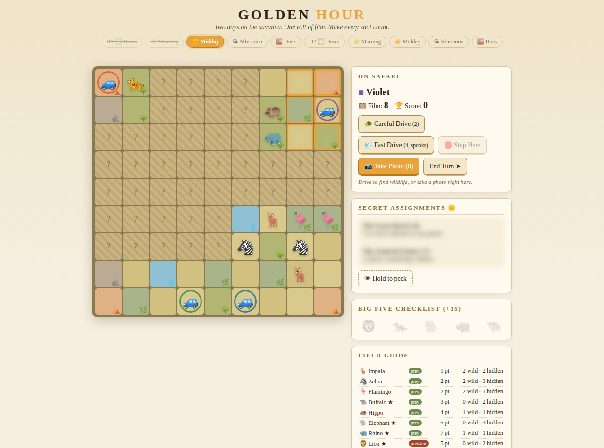

# GOLDEN HOUR 🌇

*A photo safari board game for 2–4 players. Two days on the savanna. One roll of
film. Make every shot count.*



## Play it right now

Open **[`index.html`](index.html)** in any browser — no install, no server, no
dependencies. It's a complete hot-seat digital prototype of the tabletop game:
pick 2–4 players, pass the device between turns.

```
git clone <this repo> && open photo-safari/index.html
```

## The game in one breath

You're a wildlife photographer with **8 exposures** and **10 rounds** of
shifting light. Drive your jeep **one tile at a time** across a face-down
savanna, flipping tiles to discover the animals hiding beneath — the full tile
and animal manifest is public, so you always know what's still out there. When
the moment is right, frame a **3×3 viewfinder** around your jeep and spend
precious film. Herds score big, predators + prey score bigger, and everything
scores more at **Golden Hour** (dawn & dusk). And the savanna never sits
still: every round the herds drift, predators hunt (and eat!), animals wander
off the board for good — and every animal you photograph scatters, because
**the moment passes**. Complete your **secret magazine assignments** and the
**Big Five** checklist. Best portfolio wins.

## Repo map

| File | What it is |
|---|---|
| [`index.html`](index.html) | The playable digital prototype (single file, zero deps) |
| [`RULES.md`](RULES.md) | Complete tabletop rules — everything needed for a print-and-play build |
| [`DESIGN_NOTES.md`](DESIGN_NOTES.md) | The design debate: what changed from the original pitch and why, plus the playtest agenda |

## Design pillars

1. **Luck in the world, not in your hands** — no roll-and-move; you choose
   Careful (2) or Fast (4, but animals flee). The dice-feeling comes from
   what's under the tiles and how nature behaves.
2. **Scarcity is the game** — 8 shots across 10 rounds, and scenes are
   perishable: photographed animals scatter, prey gets eaten, herds wander
   off the board. Shoot the moment, not the plan.
3. **One signature component** — the physical 3×3 viewfinder frame. Composition
   is literally geometry on the table.
4. **The theme teaches the rules** — golden light scores more, fast jeeps scare
   animals, rain gathers herds. If you've watched a nature documentary, you
   already half-know how to play.
